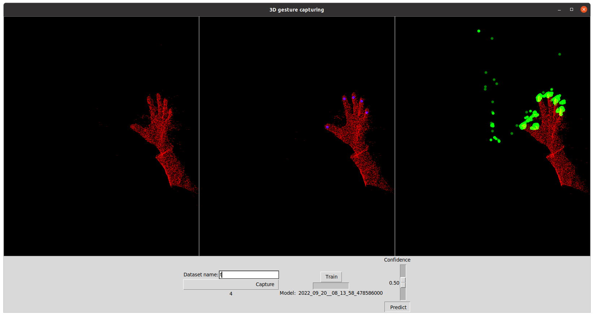

# 3d_recognizer

This repository contains a tool to train/test models on 3d point cloud segmentation. It is specifically focussed on recongnizing points on a point cloud eg fingertips.
The segementation is done by RandLa-Net. The implementation was based on this repository: [https://github.com/aRI0U/RandLA-Net-pytorch](https://github.com/aRI0U/RandLA-Net-pytorch)


## Setup
In order to run the tool, the following pre-requisites are required:
* docker (The tool was tested on `Docker version 20.10.17`)
* An Intel Realsense L515 camera (if data capturing is required)

In order to run the tool, the dockerfile (which is included in the repository) should be build. This can be done by running the `bin/docker_build` script.
This will generate docker image called `3d_gestures`.

By running the `bin/run_in_docker` script, a docker container will be started and an interactive shell in this container will be opened.
All UI options are properly set such that UI's from inside the docker container are visible on the host.
Once you close the interactive sheel with `exit`, the docker container will be automatically stopped and removed.

## Usage
_This section assumes a docker container is running and that all commands below are executed inside this docker container shell._

In order to start the 3d_recognizer tool, the following command can be run:
```shell
python3 main.py
```
The tool will automatically search a connected Intel Realsense L515 camera. If no camera was found,
It will pretend a camera was connected and instead show some pre-recorded point clouds. This
mode is mainly for demonstration purposes (mock data is located in `data/mock`).



The UI is split up in two sections. The top section shows the output of the camera and allows 3d manipulation.
The bottom part controls data storage and prediction.

### Top
The top section of the UI contains 3 3D windows. The left most shows the live feed of the camera that is
connected. The middle screen shows the last captured sample and allows annotation. The third will
show the prediction that was made on the live feed of the camera.

Each view can be manipulated by click, dragging and scrolling. This will rotate the 3d view. The 
perspective of all 3 views is linked which makes it easier to orient everything. Navigation is easiest and works best in the left-most view.

The center view allows labelling. By clicking anywhere on the shown point cloud with the middle mouse button (scroll wheel),
an annotation point will be added on the point cloud. By clicking again on the blue point (with the middle mouse button) the
annotation point will be removed again. This allows labeling specific points on the captured data.
Each annotation point is always immediately stored on disk.

### Bottom
The bottom section of the UI allows control over data capturing and predictions.

#### Capturing
In order to capture data, first a dataset name needs to be filled in. Each time you click the
'Capture' button, a capture will be added to that dataset (stored in `/data/<dataset_name>`). The
total number of samples in that dataset is shown below the 'Capture' button.
After capture was taken, it is shown in the middle 3d view so it can be labelled.

#### Training
Once a sufficient amount of point clouds were captured and labelled, it is possible to press the
'Train' button. This will train a new model based on the selected dataset. The progress bar will show
the progress of this training process. Once a model was successfully trained, the name of that model (time of training)
will be shown below the progress bar.

Note that the tool comes pre-installed with an already trained model. Once a more recent model is trained, this will
used for prediction.

#### Prediction
Finally, it is also possible to do predictions in this tool. Press the 'Predict' button in order to start
predictions. As long as the 'Predict' button is toggled on, a new prediction will be made every 250 ms. The
output is shown in the right-most 3D view. One can dynamically adjust the confidence with the slider above the 'Predict' button.
Click the 'Predict' button again to stop predictions.

### Commands

Separate from the main UI tool, this repository also includes a few scripts for convenience.
In order to train a new model, one can run `python train.py`. See `python train.py --help` for further information.

It is also possible to evaluate a model by running `python predict.py`. This will run inference a selected model.
See `python predict.py --help` for more information.

